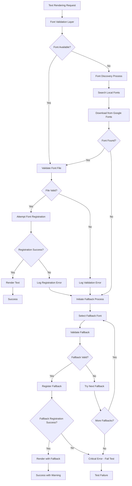

# Design Document

## Overview

The Font Error Handling Fix is designed to address critical issues in the PDF rendering system where PyMuPDF's `page.insert_font()` method fails with "need font file or buffer" error, causing tests to pass despite encountering errors. This design focuses on implementing robust error handling, comprehensive validation, and reliable fallback mechanisms to ensure font-related failures are properly detected and handled.

The solution builds upon the existing font management infrastructure in `font_utils.py` and `render.py` while adding comprehensive error handling and validation layers to prevent silent failures and improve system reliability.

## Architecture

### High-Level Error Handling Flow



### Core Components

#### 1. Font Validation Layer

- **Purpose**: Pre-validate fonts before attempting registration
- **Responsibilities**:
  - File existence and readability checks
  - Font format validation (TTF, OTF)
  - Font metadata extraction and verification
  - Early detection of font file issues

#### 2. Enhanced Error Handler

- **Purpose**: Comprehensive error handling and reporting
- **Responsibilities**:
  - Catch and classify font registration errors
  - Provide detailed error context and diagnostics
  - Aggregate multiple font errors for reporting
  - Generate actionable error messages

#### 3. Robust Fallback Manager

- **Purpose**: Reliable font fallback selection and registration
- **Responsibilities**:
  - Maintain prioritized list of fallback fonts
  - Validate fallback fonts before use
  - Track font substitutions for reporting
  - Ensure at least one font always works

## Components and Interfaces

### Enhanced Font Registration Interface

```python
class FontRegistrationResult:
    """Result of font registration attempt"""
    success: bool
    font_name: str
    actual_font_used: str
    error_message: Optional[str]
    fallback_used: bool
    validation_errors: List[str]

class FontValidator:
    """Validates font files before registration"""
    
    def validate_font_file(self, font_path: str) -> ValidationResult:
        """Validate font file exists and is readable"""
        pass
    
    def validate_font_format(self, font_path: str) -> ValidationResult:
        """Validate font file format (TTF, OTF, etc.)"""
        pass
    
    def extract_font_metadata(self, font_path: str) -> FontMetadata:
        """Extract and validate font metadata"""
        pass

class EnhancedFontRegistrar:
    """Enhanced font registration with comprehensive error handling"""
    
    def register_font_with_validation(
        self, 
        page: fitz.Page, 
        font_name: str, 
        font_path: Optional[str] = None,
        text_content: Optional[str] = None,
        element_id: Optional[str] = None
    ) -> FontRegistrationResult:
        """Register font with comprehensive validation and error handling"""
        pass
    
    def register_with_fallback(
        self,
        page: fitz.Page,
        font_name: str,
        text_content: str,
        element_id: str
    ) -> FontRegistrationResult:
        """Register font with automatic fallback on failure"""
        pass
```

### Error Handling and Reporting

```python
class FontError(Exception):
    """Base class for font-related errors"""
    def __init__(self, message: str, font_name: str, context: Dict[str, Any]):
        self.font_name = font_name
        self.context = context
        super().__init__(message)

class FontRegistrationError(FontError):
    """Font registration failed"""
    pass

class FontValidationError(FontError):
    """Font validation failed"""
    pass

class FontErrorReporter:
    """Comprehensive font error reporting"""
    
    def report_registration_error(
        self,
        font_name: str,
        error: Exception,
        context: Dict[str, Any]
    ) -> None:
        """Report font registration error with full context"""
        pass
    
    def report_validation_error(
        self,
        font_path: str,
        validation_errors: List[str],
        context: Dict[str, Any]
    ) -> None:
        """Report font validation errors"""
        pass
    
    def generate_error_summary(self) -> Dict[str, Any]:
        """Generate summary of all font errors encountered"""
        pass
```

### Fallback Management

```python
class FallbackFontManager:
    """Manages font fallback selection and validation"""
    
    # Prioritized list of fallback fonts (most reliable first)
    FALLBACK_FONTS = [
        "Helvetica",      # Standard PDF font
        "Arial",          # Common system font
        "Times-Roman",    # Standard PDF font
        "Courier",        # Standard PDF font
        "helv",           # PyMuPDF built-in
    ]
    
    def select_fallback_font(
        self,
        original_font: str,
        text_content: str,
        page: fitz.Page
    ) -> Optional[str]:
        """Select and validate appropriate fallback font"""
        pass
    
    def validate_fallback_font(
        self,
        font_name: str,
        page: fitz.Page
    ) -> bool:
        """Validate that fallback font can be registered"""
        pass
    
    def track_substitution(
        self,
        original_font: str,
        fallback_font: str,
        element_id: str,
        reason: str
    ) -> None:
        """Track font substitution for reporting"""
        pass
```

## Data Models

### Font Validation Models

```python
class ValidationResult:
    """Result of font validation"""
    valid: bool
    errors: List[str]
    warnings: List[str]
    metadata: Optional[Dict[str, Any]]

class FontMetadata:
    """Font file metadata"""
    family_name: str
    style_name: str
    format: str  # "TTF", "OTF", etc.
    file_size: int
    checksum: str
    glyph_count: int

class FontSubstitution:
    """Record of font substitution"""
    original_font: str
    substituted_font: str
    element_id: str
    reason: str
    timestamp: datetime
    text_content: Optional[str]
```

## Error Handling Strategy

### Error Classification

1. **Critical Errors** (Fail test immediately):
   - All fallback fonts fail to register
   - Font file corruption that prevents any rendering
   - PyMuPDF engine failures

2. **Warning Errors** (Log and continue with fallback):
   - Specific font not found but fallback available
   - Font file validation issues with working alternatives
   - Glyph coverage issues with acceptable fallbacks

3. **Info Errors** (Log for debugging):
   - Font cache misses
   - Google Fonts download attempts
   - Font substitution notifications

### Error Recovery Flow

```python
def enhanced_font_registration_flow(page, font_name, text_content, element_id):
    """Enhanced font registration with comprehensive error handling"""
    
    # Step 1: Validate font file if path is known
    font_path = find_font_file(font_name)
    if font_path:
        validation_result = validate_font_file(font_path)
        if not validation_result.valid:
            log_validation_errors(font_name, validation_result.errors)
            # Continue to fallback process
    
    # Step 2: Attempt font registration with error handling
    try:
        if font_path and validation_result.valid:
            page.insert_font(fontfile=font_path, fontname=font_name)
            return FontRegistrationResult(success=True, font_name=font_name)
    except Exception as e:
        if "need font file or buffer" in str(e):
            log_registration_error(font_name, e, {"font_path": font_path, "element_id": element_id})
        else:
            # Re-raise unexpected errors
            raise
    
    # Step 3: Fallback process
    fallback_manager = FallbackFontManager()
    for fallback_font in fallback_manager.FALLBACK_FONTS:
        try:
            if fallback_manager.validate_fallback_font(fallback_font, page):
                page.insert_font(fontname=fallback_font)  # Standard PDF fonts don't need file
                fallback_manager.track_substitution(
                    font_name, fallback_font, element_id, "Registration failure"
                )
                return FontRegistrationResult(
                    success=True, 
                    font_name=fallback_font, 
                    fallback_used=True
                )
        except Exception as e:
            log_fallback_error(fallback_font, e)
            continue
    
    # Step 4: Critical failure - no fonts work
    raise FontRegistrationError(
        f"All font registration attempts failed for '{font_name}' and fallbacks",
        font_name=font_name,
        context={"element_id": element_id, "text_content": text_content}
    )
```

## Testing Strategy

### Unit Testing Approach

1. **Font Validation Tests**:
   - Test file existence validation
   - Test font format validation
   - Test corrupted font file handling
   - Test metadata extraction

2. **Error Handling Tests**:
   - Test "need font file or buffer" error handling
   - Test fallback font selection
   - Test error reporting and logging
   - Test critical error propagation

3. **Fallback Management Tests**:
   - Test fallback font prioritization
   - Test fallback validation
   - Test substitution tracking
   - Test edge cases (all fallbacks fail)

### Integration Testing

1. **End-to-End Font Registration**:
   - Test complete font registration flow with errors
   - Test error recovery and fallback mechanisms
   - Test error reporting integration

2. **Test Failure Validation**:
   - Verify that font errors cause test failures when appropriate
   - Test that warnings don't cause test failures
   - Validate error message quality and actionability

## Implementation Approach

### Phase 1: Enhanced Error Detection

1. **Modify `ensure_font_registered()` function**:
   - Add comprehensive try-catch around `page.insert_font()`
   - Implement specific handling for "need font file or buffer" error
   - Add detailed error logging with context

2. **Create FontValidator class**:
   - Implement font file validation
   - Add font format checking
   - Create metadata extraction utilities

### Phase 2: Robust Fallback System

1. **Implement FallbackFontManager**:
   - Create prioritized fallback font list
   - Add fallback validation logic
   - Implement substitution tracking

2. **Enhance font registration flow**:
   - Integrate validation layer
   - Add fallback selection logic
   - Implement comprehensive error handling

### Phase 3: Error Reporting and Testing

1. **Create FontErrorReporter**:
   - Implement error aggregation and reporting
   - Add actionable error messages
   - Create error summary generation

2. **Update test infrastructure**:
   - Ensure font errors cause test failures
   - Add font error validation to test suite
   - Create comprehensive font error test cases

### Integration Points

1. **Update `render.py`**:
   - Replace direct `ensure_font_registered()` calls with enhanced version
   - Add error handling in `_render_text_with_fallback()`
   - Implement proper error propagation

2. **Enhance `font_utils.py`**:
   - Refactor existing font registration logic
   - Add new validation and error handling components
   - Maintain backward compatibility

3. **Update test configuration**:
   - Configure tests to fail on font registration errors
   - Add font error reporting to test output
   - Create font-specific test fixtures

This design provides a comprehensive solution to the font registration error handling issue while maintaining system reliability and improving debugging capabilities.