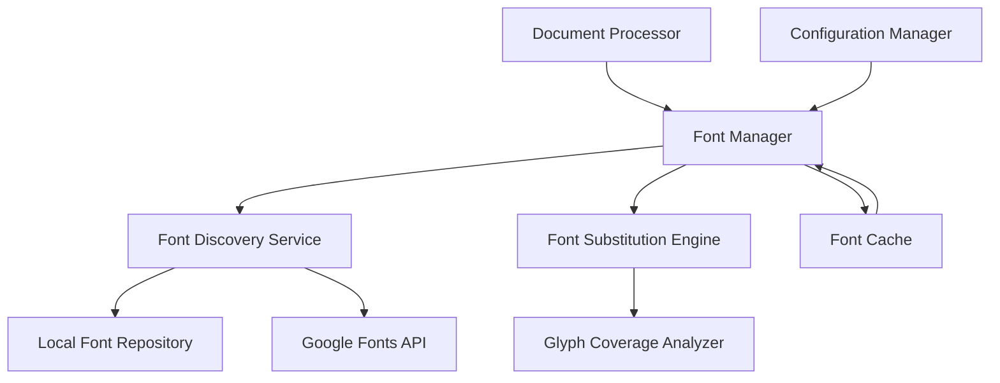

# Design Document

## Overview

The Font Management System is designed to provide streamlined font handling capabilities for the Multi-Format Document Engine, focusing on PDF validation and reproduction. It addresses the essential challenges of font discovery, fallback selection, and glyph coverage verification while leveraging existing libraries like fonttools.

The system follows a pragmatic approach that builds upon the existing font handling capabilities in `font_utils.py` while simplifying font management for document processing workflows.

## Architecture

### High-Level System Architecture



### Core Components

#### 1. Font Manager

- **Purpose**: Central coordination of font-related operations
- **Responsibilities**:
  - Font registration and tracking
  - Coordinating font discovery and substitution
  - Managing simple font caching
  - Providing clean API for document processing

#### 2. Font Discovery Service

- **Purpose**: Locate and provide access to font resources
- **Capabilities**:
  - Scan configured font directory
  - Interface with Google Fonts API
  - Download missing fonts when available
  - Organize downloaded fonts with license information

#### 3. Font Substitution Engine

- **Purpose**: Select appropriate fallbacks when exact fonts are unavailable
- **Capabilities**:
  - Basic font characteristic matching
  - Glyph coverage verification
  - Standard fallback selection
  - Clear reporting of substitutions

## Components and Interfaces

### Font Manager Interface

```python
class FontManager:
    def __init__(self, config: FontConfig):
        """Initialize with configuration"""
        pass

    def register_font(self, font_name: str, font_path: Optional[str] = None) -> bool:
        """Register a font with the system"""
        pass

    def get_font(self, font_name: str, text_content: Optional[str] = None) -> Optional[FontInfo]:
        """Get font information, optionally checking glyph coverage for text"""
        pass

    def find_substitute(self, font_name: str, text_content: str) -> Optional[str]:
        """Find appropriate substitute for a font"""
        pass

    def refresh_cache(self) -> None:
        """Refresh the font cache"""
        pass
```

### Font Discovery Service Interface

```python
class FontDiscoveryService:
    def scan_directory(self, directory: str) -> Dict[str, str]:
        """Scan directory for font files"""
        pass

    def search_font(self, font_name: str) -> Optional[str]:
        """Search for a font by name"""
        pass

    def download_font(self, font_name: str) -> Optional[str]:
        """Download a font from Google Fonts"""
        pass

    def get_font_info(self, font_path: str) -> FontInfo:
        """Extract basic metadata from a font file"""
        pass
```

### Font Substitution Engine Interface

```python
class FontSubstitutionEngine:
    def check_glyph_coverage(self, font_path: str, text: str) -> bool:
        """Check if font covers all glyphs in text"""
        pass

    def find_fallback(self, font_name: str, text: str) -> Optional[str]:
        """Find a fallback font that covers the text"""
        pass
```

## Data Models

### Font Information Models

```python
class FontInfo:
    name: str
    family: str
    style: str
    weight: int
    italic: bool
    path: str
    format: str  # "TTF", "OTF", etc.

class FontConfig:
    font_directory: str
    download_directory: str
    enable_google_fonts: bool
    fallback_font: str
    cache_file: str
```

### Font Cache Design

The font cache will be implemented as a simple, file-based cache:

1. **Memory Cache**: In-memory dictionary of font name to font path
   - Fast access for current process
   - Cleared when process terminates

2. **Persistent Cache**: Simple JSON file with font metadata
   - Maps font names to file paths
   - Stores basic font information
   - Updated when new fonts are discovered

Cache invalidation will occur:

- When new fonts are added to the configured directory
- When font files are modified
- On explicit refresh requests

## Font Matching Approach

The font matching approach will be straightforward:

1. **Name Matching**:
   - Exact name match
   - Family name match with style variation
   - Normalized name comparison (removing spaces, case-insensitive)

2. **Glyph Coverage**:
   - Check if font covers required characters
   - Use fonttools for efficient glyph coverage checking

## Error Handling

### Error Hierarchy

```python
class FontError(Exception):
    """Base exception for all font-related errors"""
    pass

class FontNotFoundError(FontError):
    """Font could not be found locally or remotely"""
    pass

class GlyphCoverageError(FontError):
    """Font does not cover required glyphs"""
    pass

class FontRegistrationError(FontError):
    """Error during font registration"""
    pass
```

### Error Recovery Strategies

1. **Clear Messaging**: Provide informative messages about missing fonts
2. **Standard Fallbacks**: Use well-supported fallback fonts when needed
3. **Logging**: Log font issues for troubleshooting
4. **Graceful Degradation**: Continue processing with fallback fonts when possible

## Testing Strategy

### Unit Testing

- **Font Discovery**: Test scanning directories and identifying font files
- **Metadata Extraction**: Verify correct extraction of font information
- **Glyph Coverage**: Test coverage analysis for various character sets
- **Substitution Logic**: Verify appropriate font selection for fallbacks

### Integration Testing

- **End-to-End Font Registration**: Test complete font registration workflow
- **Google Fonts Integration**: Verify font download functionality
- **Cache Performance**: Test cache hit rates and invalidation

## Implementation Approach

### Font Directory Structure

```
downloaded_fonts/
├── Font-Family-Name/
│   ├── Font-Regular.ttf
│   ├── Font-Bold.ttf
│   └── LICENSE.txt
├── Another-Font-Family/
│   ├── Another-Font-Regular.ttf
│   └── LICENSE.txt
└── ...
```

### Leveraging Existing Libraries

- **fonttools**: Use for font analysis, metadata extraction, and glyph coverage checking
- **PyMuPDF**: Continue using for PDF font registration and rendering
- **requests**: Use for Google Fonts API integration

### Integration with Existing Code

1. **Refactor `font_utils.py`**:
   - Extract core functionality into the new Font Manager
   - Maintain backward compatibility for existing code
   - Gradually migrate to the new API

2. **Enhance Font Discovery**:
   - Improve font directory scanning
   - Add Google Fonts integration
   - Implement simple font caching

3. **Improve Fallback Selection**:
   - Enhance glyph coverage checking
   - Implement basic fallback selection logic
   - Add clear reporting of font substitutions

This design provides a pragmatic foundation for the Font Management System while ensuring compatibility with the existing Multi-Format Document Engine architecture and focusing on the essential needs for PDF validation and reproduction.
