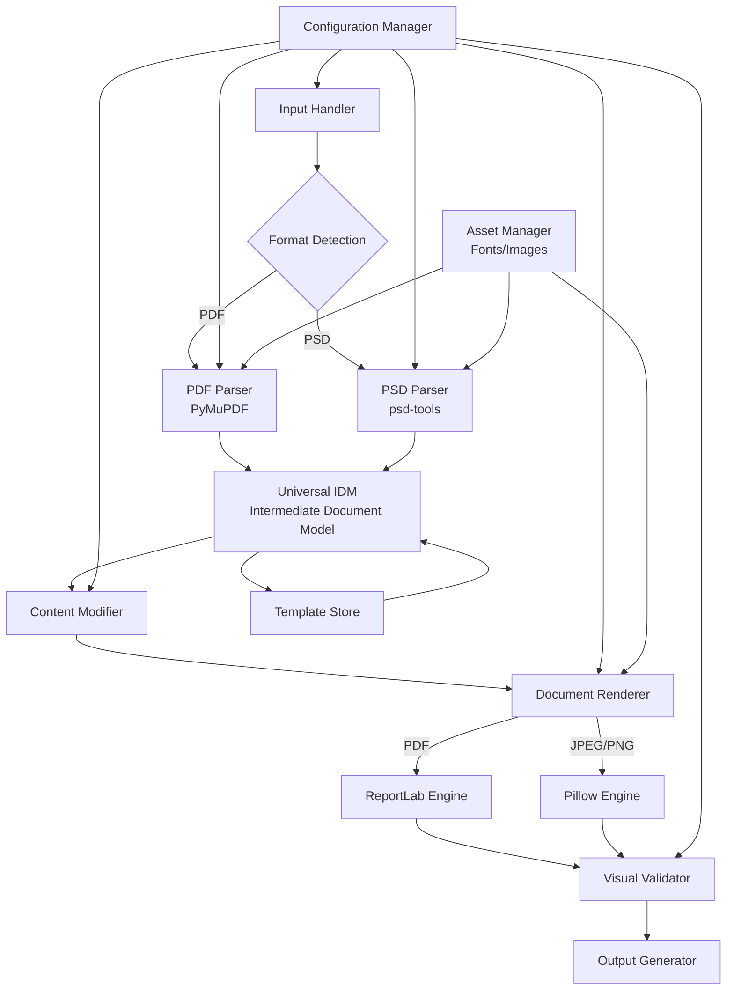

# Design Document

## Overview

The Multi-Format Document Engine extends the existing PDF Layout Extractor and Rebuilder into a comprehensive system supporting both PDF and PSD formats with automated visual validation. The design follows a modular, pipeline-based architecture that separates concerns while maintaining high cohesion within each processing phase.

The system transforms documents through a sequential pipeline: Input → Extraction → Intermediate Representation → Modification → Rendering → Validation → Output. This approach enables independent development and testing of each component while providing clear data flow and error boundaries.

## Architecture

### High-Level System Architecture



### Core Components

#### 1. Input Handler and Format Detection

- **Purpose**: Route documents to appropriate parsers based on file format
- **Implementation**: File signature detection using magic bytes
- **Supported Formats**: PDF (existing), PSD (new), with extensible plugin architecture

#### 2. Universal Intermediate Document Model (IDM)

- **Schema Version**: 1.0 (extensible for future formats)
- **Structure**: JSON-serializable Python objects representing document hierarchy
- **Key Features**:
  - Format-agnostic element representation
  - Layer hierarchy support
  - Metadata preservation
  - Template persistence capability

#### 3. Multi-Format Parsers

- **PDF Parser**: Enhanced version of existing PyMuPDF-based extractor
- **PSD Parser**: New implementation using psd-tools library
- **Plugin Architecture**: Interface for adding new format parsers

#### 4. Content Modification Engine

- **Text Processing**: Intelligent reflow with configurable rules
- **Asset Management**: Font and image path resolution
- **Validation**: Pre-modification compatibility checks

#### 5. Multi-Engine Renderer

- **PDF Rendering**: ReportLab with precise positioning and font embedding, or fritz/PyMuPDF
- **Raster Rendering**: Pillow-based high-DPI image generation or Cairo
- **Extensible Output**: Plugin architecture for additional formats

#### 6. Automated Visual Validator

- **Comparison Engine**: SSIM-based visual similarity measurement
- **Threshold Management**: Configurable quality gates
- **Diagnostic Output**: Visual diff generation and detailed reporting

## Components and Interfaces

### Universal IDM Schema

```python
class UniversalDocument:
    version: str = "1.0"
    engine: str  # "fitz", "psd-tools", etc.
    engine_version: str
    metadata: DocumentMetadata
    document_structure: List[DocumentUnit]

class DocumentUnit:
    type: str  # "page" or "canvas"
    size: Tuple[float, float]
    background_color: Optional[Color]
    layers: List[Layer]

class Layer:
    layer_id: str
    layer_name: str
    layer_type: str  # "base", "text", "image", "shape", "group"
    bbox: BoundingBox
    visibility: bool
    opacity: float
    blend_mode: str
    children: List[Layer]  # For group layers
    content: List[Element]

class Element:
    type: str  # "text", "image", "drawing"
    id: str
    bbox: BoundingBox
    z_index: int
    # Type-specific properties defined in subclasses
```

### Parser Interface

```python
class DocumentParser(ABC):
    @abstractmethod
    def can_parse(self, file_path: str) -> bool:
        """Check if this parser can handle the given file"""
        pass

    @abstractmethod
    def parse(self, file_path: str) -> UniversalDocument:
        """Parse document into Universal IDM"""
        pass

    @abstractmethod
    def extract_assets(self, file_path: str, output_dir: str) -> AssetManifest:
        """Extract and save images, fonts, and other assets"""
        pass
```

### Renderer Interface

```python
class DocumentRenderer(ABC):
    @abstractmethod
    def can_render(self, output_format: str) -> bool:
        """Check if this renderer supports the output format"""
        pass

    @abstractmethod
    def render(self, document: UniversalDocument, output_path: str,
               config: RenderConfig) -> RenderResult:
        """Render document to specified format"""
        pass
```

### Visual Validator Interface

```python
class VisualValidator:
    def __init__(self, config: ValidationConfig):
        self.ssim_threshold = config.ssim_threshold
        self.rendering_engine = config.rendering_engine

    def validate(self, original_path: str, generated_path: str) -> ValidationResult:
        """Compare documents and return validation result"""
        pass

    def generate_diff(self, original_path: str, generated_path: str,
                     output_path: str) -> None:
        """Generate visual difference image"""
        pass
```

## Data Models

### Enhanced Element Types

#### Text Element

```python
class TextElement(Element):
    raw_text: str  # Original with spacing issues
    text: str      # Normalized content
    font_details: FontDetails
    writing_mode: int
    writing_direction: Tuple[float, float]
    align: int
    adjust_spacing: bool
    background_color: Optional[Color]

class FontDetails:
    name: str
    size: float
    color: Color
    ascender: float
    descender: float
    is_superscript: bool
    is_italic: bool
    is_serif: bool
    is_monospaced: bool
    is_bold: bool
    original_flags: int
    kerning: Optional[Dict[str, float]]
    leading: Optional[float]
```

#### Image Element

```python
class ImageElement(Element):
    image_file: str  # Path to extracted image
    original_format: str
    dpi: int
    color_space: str
    has_transparency: bool
    transformation_matrix: Optional[List[float]]
```

#### Drawing Element

```python
class DrawingElement(Element):
    color: Optional[Color]  # Stroke color
    fill: Optional[Color]   # Fill color
    width: float           # Stroke width
    drawing_commands: List[DrawingCommand]
    original_shape_type: Optional[str]
    stroke_details: Optional[StrokeDetails]
    fill_details: Optional[FillDetails]

class DrawingCommand:
    cmd: str  # "M", "L", "C", "H", "rect", "ellipse"
    pts: List[float]
    bbox: Optional[BoundingBox]  # For primitive shapes
```

### Configuration Models

```python
class SystemConfig:
    font_directories: List[str]
    asset_cache_dir: str
    temp_dir: str
    max_memory_mb: int
    enable_parallel_processing: bool
    log_level: str

class ValidationConfig:
    ssim_threshold: float = 0.98
    rendering_dpi: int = 300
    comparison_engine: str = "opencv"
    generate_diff_images: bool = True
    fail_on_font_substitution: bool = False

class RenderConfig:
    output_dpi: int = 300
    embed_fonts: bool = True
    color_space: str = "RGB"
    compression_quality: int = 95
    fallback_font: str = "Arial"
```

## Error Handling

### Error Hierarchy

```python
class DocumentEngineError(Exception):
    """Base exception for all document engine errors"""
    pass

class ParseError(DocumentEngineError):
    """Errors during document parsing"""
    pass

class RenderError(DocumentEngineError):
    """Errors during document rendering"""
    pass

class ValidationError(DocumentEngineError):
    """Errors during visual validation"""
    pass

class AssetError(DocumentEngineError):
    """Errors related to fonts, images, or other assets"""
    pass

class ConfigurationError(DocumentEngineError):
    """Configuration-related errors"""
    pass
```

### Error Recovery Strategies

1. **Graceful Degradation**: Continue processing with warnings when non-critical elements fail
2. **Asset Fallbacks**: Automatic substitution of missing fonts/images with configured alternatives
3. **Partial Success**: Return successfully processed elements even when some fail
4. **Detailed Logging**: Comprehensive error context for debugging and user guidance
5. **Validation Bypass**: Option to skip visual validation for debugging purposes

## Testing Strategy

### Unit Testing

- **Parser Tests**: Verify correct extraction from sample PDF/PSD files
- **IDM Tests**: Validate Universal Document Model serialization/deserialization
- **Renderer Tests**: Confirm output generation matches expected formats
- **Validator Tests**: Test SSIM calculations and threshold handling

### Integration Testing

- **End-to-End Pipeline**: Complete document transformation workflows
- **Format Compatibility**: Cross-format processing (PDF→PDF, PSD→PDF, etc.)
- **Asset Management**: Font embedding and image extraction workflows
- **Error Scenarios**: Graceful handling of corrupted or invalid inputs

### Visual Regression Testing

- **Reference Images**: Maintain golden master images for comparison
- **Automated Validation**: CI/CD integration with visual difference detection
- **Threshold Calibration**: Empirical determination of acceptable SSIM values
- **Cross-Platform Testing**: Ensure consistent rendering across operating systems

### Performance Testing

- **Memory Usage**: Monitor memory consumption with large documents
- **Processing Speed**: Benchmark extraction and rendering performance
- **Batch Processing**: Test parallel processing capabilities
- **Cache Effectiveness**: Validate asset caching improves performance

## Security Considerations

### Input Validation

- **File Format Verification**: Validate file signatures and structure
- **Size Limits**: Prevent processing of excessively large files
- **Path Traversal**: Sanitize file paths in asset extraction
- **Memory Limits**: Prevent memory exhaustion attacks

### Asset Security

- **Font Licensing**: Verify embedding permissions before processing
- **Image Rights**: Audit trail for processed images and their sources
- **Temporary Files**: Secure cleanup of extracted assets
- **Access Controls**: Restrict access to font and asset directories

### Output Security

- **Content Sanitization**: Remove potentially malicious embedded content
- **Metadata Scrubbing**: Option to remove sensitive metadata from outputs
- **Watermarking**: Optional watermark insertion for generated documents
- **Audit Logging**: Comprehensive logging of all processing activities

## Performance Optimization

### Memory Management

- **Streaming Processing**: Process large documents in chunks where possible
- **Asset Caching**: Cache frequently used fonts and images
- **Garbage Collection**: Explicit cleanup of large objects
- **Memory Monitoring**: Track and limit memory usage per operation

### Processing Optimization

- **Parallel Extraction**: Multi-threaded processing of independent elements
- **Lazy Loading**: Load assets only when needed for rendering
- **Template Reuse**: Cache parsed IDM structures for repeated use
- **Incremental Updates**: Support partial document modifications

### Caching Strategy

- **Font Metrics Cache**: Store calculated font measurements
- **Rendered Assets Cache**: Cache high-resolution renderings
- **IDM Template Cache**: Store frequently used document templates
- **Validation Cache**: Cache visual comparison results for unchanged documents

This design provides a robust foundation for the Multi-Format Document Engine while maintaining compatibility with the existing PDF processing capabilities and enabling future extensibility.
