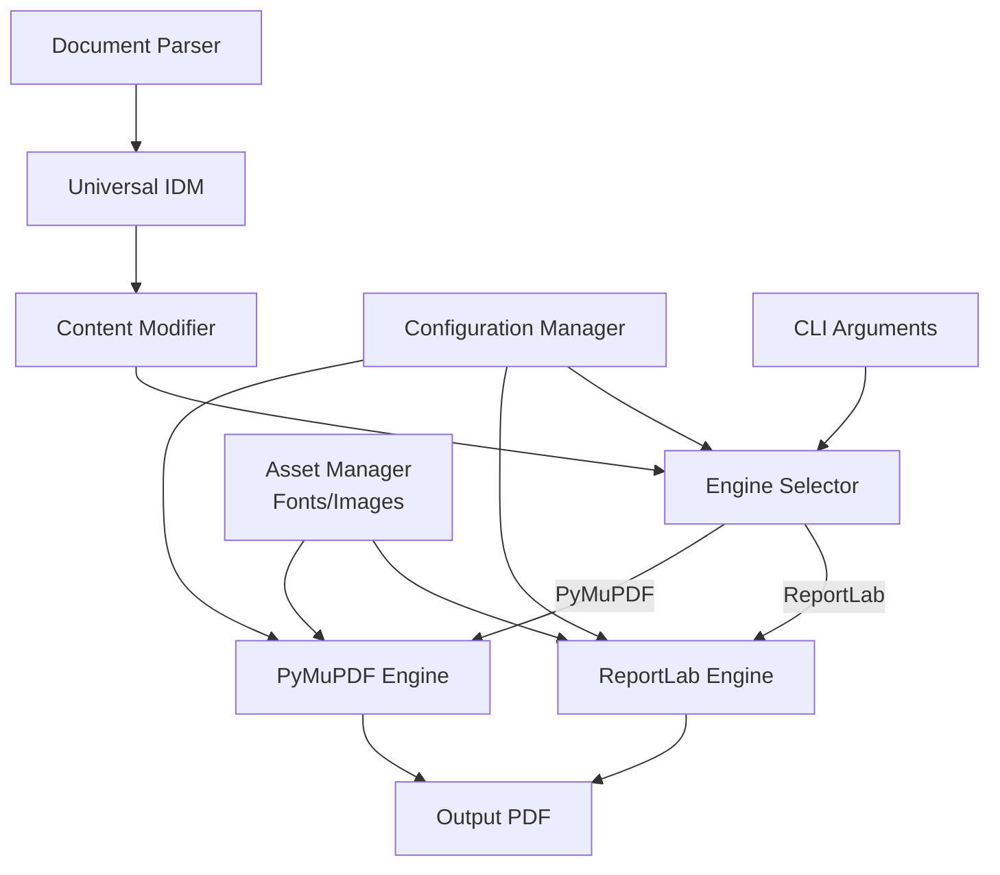

# Design Document

## Overview

The Output Engine Selection feature enhances the Multi-Format Document Engine by providing a flexible mechanism to choose between different PDF rendering engines. This design builds upon the existing architecture while introducing a new abstraction layer for PDF rendering engines, allowing seamless switching between ReportLab and PyMuPDF (fitz) backends.

The implementation follows the Strategy pattern, where different rendering engines implement a common interface, enabling runtime selection without changing the client code. This approach maintains backward compatibility while providing new capabilities for advanced users.

## Architecture

### High-Level System Architecture



### Core Components

#### 1. PDF Engine Interface

- **Purpose**: Define a common interface for all PDF rendering engines
- **Implementation**: Abstract base class with required methods
- **Key Methods**: `render_document()`, `render_page()`, `render_element()`

#### 2. Engine Implementations

- **ReportLab Engine**: Existing implementation using ReportLab
- **PyMuPDF Engine**: Enhanced implementation using PyMuPDF (fitz)
- **Plugin Architecture**: Interface for adding new engine implementations

#### 3. Engine Selector

- **Purpose**: Select and instantiate the appropriate engine based on configuration
- **Implementation**: Factory pattern with engine registry
- **Configuration**: Command-line arguments, config file settings

#### 4. Engine-Specific Configuration

- **Purpose**: Store and apply engine-specific parameters
- **Implementation**: Nested configuration objects in main config
- **Validation**: Schema-based validation for each engine's parameters

## Components and Interfaces

### PDF Engine Interface

```python
class PDFRenderingEngine(ABC):
    """Abstract base class for PDF rendering engines"""

    @abstractmethod
    def initialize(self, config: dict) -> None:
        """Initialize the engine with configuration"""
        pass

    @abstractmethod
    def create_document(self, metadata: dict) -> Any:
        """Create a new document with the given metadata"""
        pass

    @abstractmethod
    def add_page(self, document: Any, size: Tuple[float, float],
                 background_color: Optional[Color] = None) -> Any:
        """Add a new page to the document"""
        pass

    @abstractmethod
    def render_element(self, page: Any, element: dict,
                      resources: dict) -> dict:
        """Render an element on the page"""
        pass

    @abstractmethod
    def finalize_document(self, document: Any, output_path: str) -> None:
        """Finalize and save the document"""
        pass

    @abstractmethod
    def get_engine_info(self) -> dict:
        """Get information about the engine"""
        pass
```

### ReportLab Engine Implementation

```python
class ReportLabEngine(PDFRenderingEngine):
    """ReportLab implementation of the PDF rendering engine"""

    def initialize(self, config: dict) -> None:
        """Initialize ReportLab with configuration"""
        self.compression = config.get("compression", 1)
        self.page_mode = config.get("page_mode", "portrait")
        # Other ReportLab-specific initialization

    def create_document(self, metadata: dict) -> Any:
        """Create a new ReportLab document"""
        from reportlab.pdfgen import canvas
        from reportlab.lib.pagesizes import letter

        # Create document with metadata
        # ...

        return doc

    # Other method implementations...
```

### PyMuPDF Engine Implementation

```python
class PyMuPDFEngine(PDFRenderingEngine):
    """PyMuPDF implementation of the PDF rendering engine"""

    def initialize(self, config: dict) -> None:
        """Initialize PyMuPDF with configuration"""
        self.overlay_mode = config.get("overlay_mode", False)
        self.annotation_mode = config.get("annotation_mode", "ignore")
        # Other PyMuPDF-specific initialization

    def create_document(self, metadata: dict) -> Any:
        """Create a new PyMuPDF document"""
        import fitz

        # Create document with metadata
        doc = fitz.open()

        # Set metadata if provided
        if metadata:
            doc.set_metadata(metadata)

        return doc

    # Other method implementations...
```

### Engine Selector

```python
class PDFEngineSelector:
    """Factory for PDF rendering engines"""

    def __init__(self):
        self.engines = {}
        self.register_default_engines()

    def register_engine(self, name: str, engine_class: Type[PDFRenderingEngine]) -> None:
        """Register a new engine"""
        self.engines[name.lower()] = engine_class

    def register_default_engines(self) -> None:
        """Register the default engines"""
        from .engines.reportlab_engine import ReportLabEngine
        from .engines.pymupdf_engine import PyMuPDFEngine

        self.register_engine("reportlab", ReportLabEngine)
        self.register_engine("pymupdf", PyMuPDFEngine)
        self.register_engine("fitz", PyMuPDFEngine)  # Alias for PyMuPDF

    def get_engine(self, name: str, config: dict) -> PDFRenderingEngine:
        """Get an instance of the specified engine"""
        name = name.lower()
        if name not in self.engines:
            raise ValueError(f"Unknown PDF rendering engine: {name}. "
                           f"Available engines: {', '.join(self.engines.keys())}")

        engine = self.engines[name]()
        engine.initialize(config.get(name, {}))
        return engine

    def get_default_engine(self, config: dict) -> PDFRenderingEngine:
        """Get the default engine based on configuration"""
        default_engine = config.get("default_engine", "reportlab").lower()
        return self.get_engine(default_engine, config)
```

### Configuration Schema

```python
ENGINE_CONFIG_SCHEMA = {
    "type": "object",
    "properties": {
        "default_engine": {
            "type": "string",
            "enum": ["reportlab", "pymupdf", "fitz"],
            "default": "reportlab"
        },
        "reportlab": {
            "type": "object",
            "properties": {
                "compression": {
                    "type": "integer",
                    "minimum": 0,
                    "maximum": 9,
                    "default": 1
                },
                "page_mode": {
                    "type": "string",
                    "enum": ["portrait", "landscape"],
                    "default": "portrait"
                },
                "embed_fonts": {
                    "type": "boolean",
                    "default": True
                }
            }
        },
        "pymupdf": {
            "type": "object",
            "properties": {
                "overlay_mode": {
                    "type": "boolean",
                    "default": False
                },
                "annotation_mode": {
                    "type": "string",
                    "enum": ["preserve", "ignore", "remove"],
                    "default": "ignore"
                },
                "compression": {
                    "type": "string",
                    "enum": ["none", "flate", "lzw"],
                    "default": "flate"
                }
            }
        }
    }
}
```

## Implementation Plan

### Phase 1: Core Interface and Engine Abstraction

1. Define the `PDFRenderingEngine` abstract base class
2. Implement the `PDFEngineSelector` factory class
3. Create configuration schema for engine selection
4. Update CLI argument parsing to accept `--engine` parameter
5. Modify configuration loading to include engine-specific settings

### Phase 2: Engine Implementations

1. Implement `ReportLabEngine` class wrapping existing ReportLab functionality
2. Implement `PyMuPDFEngine` class wrapping existing PyMuPDF functionality
3. Ensure both engines implement the full interface with feature parity
4. Add engine-specific optimizations and features
5. Implement comprehensive error handling for each engine

### Phase 3: Integration and Testing

1. Integrate engine selection into the document generation pipeline
2. Update `recreate_pdf_from_config.py` to use the engine selector
3. Create unit tests for each engine implementation
4. Create integration tests for the complete pipeline with different engines
5. Implement performance benchmarking for engine comparison

### Phase 4: Documentation and Examples

1. Update user documentation with engine selection information
2. Create examples demonstrating different engine configurations
3. Document engine-specific features and limitations
4. Add troubleshooting information for common issues
5. Update API documentation to reflect new capabilities

## Error Handling

### Error Hierarchy

```python
class EngineError(Exception):
    """Base exception for all engine-related errors"""
    pass

class EngineNotFoundError(EngineError):
    """Raised when a requested engine is not available"""
    pass

class EngineInitializationError(EngineError):
    """Raised when an engine fails to initialize"""
    pass

class RenderingError(EngineError):
    """Raised when an error occurs during rendering"""
    pass

class UnsupportedFeatureError(EngineError):
    """Raised when an engine doesn't support a requested feature"""
    pass
```

### Error Recovery Strategies

1. **Engine Fallback**: Attempt to use the default engine if the requested engine fails
2. **Feature Degradation**: Continue with reduced functionality when a feature is unsupported
3. **Detailed Logging**: Provide engine-specific error information for troubleshooting
4. **Validation Warnings**: Flag potential issues before rendering begins
5. **Partial Success**: Return successfully rendered pages even if some fail

## Testing Strategy

### Unit Testing

- **Engine Interface Tests**: Verify that each engine properly implements the interface
- **Engine Selector Tests**: Confirm proper engine selection based on configuration
- **Configuration Tests**: Validate parsing and application of engine-specific settings
- **Error Handling Tests**: Verify proper error handling for various failure scenarios

### Integration Testing

- **End-to-End Tests**: Complete document generation with different engines
- **Feature Parity Tests**: Compare output from different engines for visual consistency
- **Configuration Override Tests**: Verify that engine-specific settings are applied correctly
- **CLI Argument Tests**: Confirm that command-line arguments properly select engines

### Performance Testing

- **Rendering Speed Tests**: Compare rendering time between engines
- **Memory Usage Tests**: Monitor and compare memory consumption
- **Large Document Tests**: Test performance with very large documents
- **Complex Layout Tests**: Test performance with complex layouts and many elements

## Performance Considerations

### Engine Selection Criteria

Different engines have different performance characteristics:

1. **ReportLab**:
   - Strengths: Precise text layout, extensive font support, smaller file sizes
   - Weaknesses: Slower for complex vector graphics, limited image format support

2. **PyMuPDF (fitz)**:
   - Strengths: Fast rendering, excellent vector graphics support, good image handling
   - Weaknesses: Less precise text layout control, larger file sizes in some cases

### Optimization Opportunities

1. **Caching**: Cache rendered elements that are reused across pages
2. **Lazy Loading**: Load resources only when needed by the selected engine
3. **Parallel Processing**: Render independent elements in parallel where supported
4. **Memory Management**: Implement engine-specific memory optimization strategies
5. **Format-Specific Optimizations**: Apply optimizations based on document content

## Migration Path

### Backward Compatibility

1. **Default Engine**: Use ReportLab as the default engine for backward compatibility
2. **Configuration Fallback**: Support existing configuration format without engine-specific sections
3. **API Compatibility**: Maintain existing API signatures with optional engine parameters
4. **Error Handling**: Provide clear error messages for engine-specific issues

### Upgrade Guide

1. **Configuration Updates**: Document how to update configuration for engine selection
2. **API Changes**: Highlight any API changes required for engine selection
3. **Feature Mapping**: Provide mapping between features in different engines
4. **Testing Recommendations**: Suggest testing strategies when switching engines

This design provides a robust foundation for implementing the Output Engine Selection feature while maintaining compatibility with existing code and providing a clear path for future enhancements.
