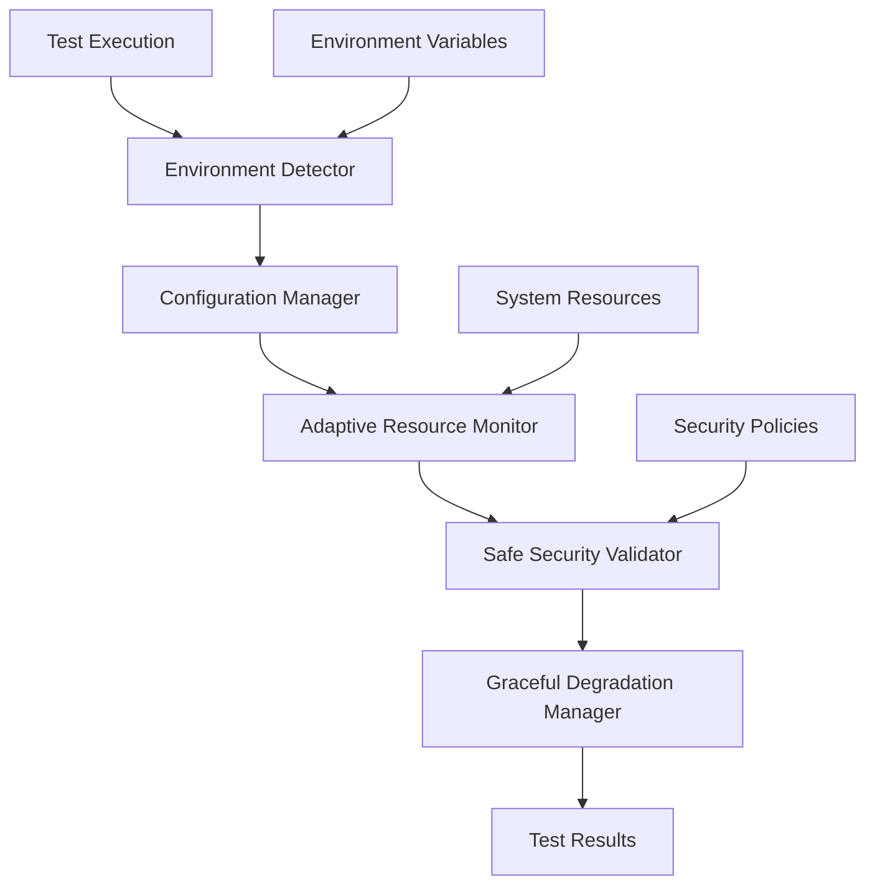

# Design Document

## Overview

This design addresses the stability issues in the enhanced security test suite by implementing adaptive resource monitoring, environment-aware test configuration, and graceful degradation strategies. The solution focuses on maintaining security validation effectiveness while preventing system-level process termination.

## Architecture

### Core Components

1. **Adaptive Resource Monitor**: Dynamically adjusts monitoring intensity based on system capabilities
2. **Test Environment Detector**: Identifies execution context (CI, development, production)
3. **Graceful Degradation Manager**: Handles resource constraints without test failure
4. **Safe Security Validator**: Implements security checks that don't trigger system protections
5. **Configuration Manager**: Manages environment-specific test settings

### Component Interactions



## Components and Interfaces

### 1. Adaptive Resource Monitor

**Purpose**: Provides resource monitoring that adapts to system constraints

**Interface**:
```python
class AdaptiveResourceMonitor:
    def __init__(self, environment_type: str, max_memory_mb: int = None)
    def get_safe_limits(self) -> ResourceLimits
    def monitor_process_safely(self, process: subprocess.Popen) -> ResourceStats
    def is_monitoring_safe(self) -> bool
```

**Key Features**:
- Detects system resource availability before setting limits
- Uses non-intrusive monitoring methods (polling vs continuous monitoring)
- Automatically reduces monitoring frequency under resource pressure
- Provides fallback monitoring for constrained environments

### 2. Test Environment Detector

**Purpose**: Identifies the execution environment and its constraints

**Interface**:
```python
class TestEnvironmentDetector:
    def detect_environment(self) -> EnvironmentType
    def get_resource_constraints(self) -> ResourceConstraints
    def is_containerized(self) -> bool
    def has_elevated_privileges(self) -> bool
```

**Detection Logic**:
- CI Environment: Check for CI-specific environment variables
- Container: Detect cgroup limits and container runtime
- Development: Local development environment indicators
- Resource Constraints: Available memory, CPU limits, disk space

### 3. Safe Security Validator

**Purpose**: Implements security validation without triggering system protections

**Interface**:
```python
class SafeSecurityValidator:
    def validate_command_safely(self, cmd: list[str]) -> ValidationResult
    def test_resource_limits_safely(self) -> TestResult
    def simulate_security_violations(self) -> SimulationResult
```

**Safety Measures**:
- Use mock processes for resource limit testing
- Implement command validation without actual execution
- Create controlled test scenarios that don't trigger system policies
- Use temporary, isolated environments for security testing

### 4. Configuration Manager

**Purpose**: Manages environment-specific test configurations

**Configuration Schema**:
```python
@dataclass
class SecurityTestConfig:
    max_memory_mb: int
    max_cpu_percent: float
    monitoring_interval: float
    enable_resource_limits: bool
    enable_audit_logging: bool
    use_mock_processes: bool
    timeout_seconds: int
```

**Environment Profiles**:
- **Development**: Relaxed limits, detailed logging, mock processes
- **CI**: Moderate limits, essential logging, real processes with safeguards
- **Production**: Strict limits, minimal logging, full security validation

## Data Models

### Resource Limits Model

```python
@dataclass
class ResourceLimits:
    memory_mb: int
    cpu_percent: float
    execution_time: int
    monitoring_safe: bool
    fallback_mode: bool
```

### Test Result Model

```python
@dataclass
class SecurityTestResult:
    test_name: str
    status: TestStatus
    execution_time: float
    resource_usage: ResourceStats
    warnings: List[str]
    degradation_applied: bool
```

### Environment Context Model

```python
@dataclass
class EnvironmentContext:
    type: EnvironmentType
    available_memory_mb: int
    cpu_cores: int
    is_containerized: bool
    has_resource_limits: bool
    security_policies: List[str]
```

## Error Handling

### Graceful Degradation Strategy

1. **Resource Pressure Detection**:
   - Monitor system memory usage before setting limits
   - Detect when monitoring itself consumes excessive resources
   - Identify when system policies prevent resource limit setting

2. **Degradation Levels**:
   - **Level 1**: Reduce monitoring frequency
   - **Level 2**: Use mock processes instead of real ones
   - **Level 3**: Skip resource-intensive tests with warnings
   - **Level 4**: Run minimal security validation only

3. **Fallback Mechanisms**:
   - Use alternative monitoring methods (e.g., time-based instead of resource-based)
   - Implement timeout-based limits when resource limits fail
   - Provide mock implementations for unavailable features

### Error Recovery

```python
class SecurityTestErrorHandler:
    def handle_resource_limit_error(self, error: ResourceLimitError) -> RecoveryAction
    def handle_monitoring_failure(self, error: MonitoringError) -> RecoveryAction
    def handle_system_kill(self, signal: int) -> RecoveryAction
```

## Testing Strategy

### Test Categories

1. **Unit Tests**: Test individual components in isolation
2. **Integration Tests**: Test component interactions with mocked system resources
3. **Environment Tests**: Validate behavior across different environments
4. **Stress Tests**: Test graceful degradation under resource pressure

### Test Environment Setup

```python
class SecurityTestEnvironment:
    def setup_controlled_environment(self) -> TestContext
    def simulate_resource_constraints(self, constraints: ResourceConstraints)
    def mock_system_policies(self, policies: List[SecurityPolicy])
    def cleanup_test_environment(self)
```

### Validation Approach

1. **Functional Validation**: Ensure security features work correctly
2. **Stability Validation**: Verify tests don't get killed by the system
3. **Performance Validation**: Confirm monitoring overhead is acceptable
4. **Compatibility Validation**: Test across different environments and platforms

## Implementation Phases

### Phase 1: Environment Detection and Configuration
- Implement environment detector
- Create configuration management system
- Add environment-specific test profiles

### Phase 2: Adaptive Resource Monitoring
- Replace fixed resource limits with adaptive limits
- Implement safe monitoring techniques
- Add graceful degradation for resource constraints

### Phase 3: Safe Security Validation
- Refactor security tests to use safe validation methods
- Implement mock processes for resource testing
- Add controlled simulation environments

### Phase 4: Error Handling and Recovery
- Implement comprehensive error handling
- Add recovery mechanisms for common failure scenarios
- Create detailed logging and diagnostics

### Phase 5: Testing and Validation
- Create comprehensive test suite for the new implementation
- Validate across different environments
- Performance testing and optimization

## Security Considerations

1. **Test Isolation**: Ensure tests don't interfere with system security
2. **Credential Management**: Handle test credentials securely
3. **Audit Trail**: Maintain security audit logs for test execution
4. **Permission Management**: Run tests with minimal required permissions

## Performance Considerations

1. **Monitoring Overhead**: Keep resource monitoring lightweight
2. **Test Execution Time**: Optimize test duration while maintaining coverage
3. **Memory Usage**: Prevent memory leaks in long-running test suites
4. **CPU Usage**: Avoid excessive CPU consumption during monitoring