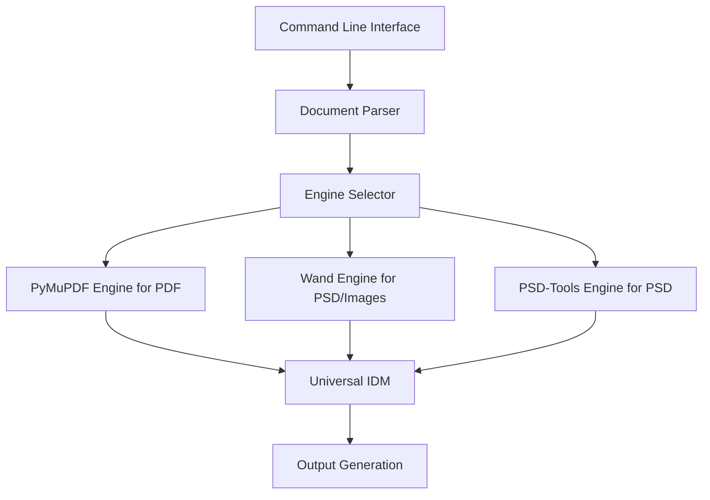

# Design Document: Wand Input Engine

## Overview

This design document outlines the technical approach for implementing Python-Wand as an input engine processor for the Multi-Format Document Engine, specifically for handling PSD files and other layered image formats. The implementation will follow the existing architecture patterns while leveraging Wand's unique capabilities for image processing and layer extraction.

## Architecture

### System Context

The Wand Input Engine will be integrated into the existing document processing pipeline as an alternative to the psd-tools engine for PSD files. It will implement the `DocumentParser` interface and be registered as an available parser in the document parser registry.



### Components and Interfaces

#### WandParser Class

A new `WandParser` class will be implemented that extends the `DocumentParser` abstract base class:

```python
class WandParser(DocumentParser):
    """Document parser using Python-Wand (ImageMagick binding) for PSD and layered image formats"""

    def can_parse(self, file_path: str) -> bool:
        """Check if this parser can handle the given file"""
        # Implementation details - check for PSD and other supported image formats

    def parse(self, file_path: str, extraction_flags: dict[str, bool] = None) -> UniversalDocument:
        """Parse document into Universal IDM"""
        # Implementation details

    def extract_assets(self, file_path: str, output_dir: str) -> AssetManifest:
        """Extract and save images, fonts, and other assets"""
        # Implementation details
```

#### Engine Selection Interface

The engine selection will be implemented through a new command-line parameter and configuration option:

```python
parser.add_argument(
    "--input-engine",
    choices=["auto", "fitz", "wand", "psd-tools"],
    default="auto",
    help="Input processing engine: 'auto' (detect), 'fitz' (PyMuPDF for PDF), 'wand' (Python-Wand for PSD/images), or 'psd-tools' (psd-tools for PSD).",
)
```

#### Wand Content Extraction Module

A new module `src/engine/extract_wand_content.py` will be created to handle the extraction of content from PSD and layered image files using Python-Wand:

```python
def extract_wand_content(file_path: str, extraction_flags: dict[str, bool] = None) -> UniversalDocument:
    """
    Extract content from a PSD or layered image file using Python-Wand.

    Args:
        file_path: Path to the image file
        extraction_flags: Optional flags to control extraction behavior

    Returns:
        UniversalDocument: Extracted document structure
    """
    # Implementation details
```

## Data Models

### Universal Document Structure

The Wand engine will populate the same Universal Document Structure Schema as the existing engines:

```python
UniversalDocument(
    version="1.0",
    engine="wand",
    engine_version="...",  # Wand and ImageMagick versions
    metadata=DocumentMetadata(...),
    document_structure=[
        # Page or Canvas objects
    ]
)
```

### Wand-Specific Configuration

Wand-specific configuration options will be added to the settings module:

```python
WAND_CONFIG = {
    "density": 300,  # DPI for rasterization
    "use_ocr": False,  # Whether to use OCR for text extraction
    "tesseract_lang": "eng",  # OCR language
    "image_format": "png",  # Format for extracted images
    "color_management": True,  # Whether to use color management
}
```

## Implementation Details

### Layer Extraction

Layer extraction from PSD files using Wand will be the primary focus:

1. **Layer Hierarchy**: Extract the complete layer structure including groups and nested layers
2. **Layer Properties**: Extract layer visibility, opacity, blend mode, and position
3. **Layer Effects**: Extract layer styles and effects (drop shadow, bevel, etc.)
4. **Smart Objects**: Handle smart objects by extracting their rendered appearance

The layer extraction process will:

1. Identify all layers in the document
2. Determine layer hierarchy and grouping
3. Extract layer properties and positioning
4. Convert to the Universal Document Structure format

### Text Extraction

Text extraction from PSD files using Wand has limitations:

1. **Rasterized Text**: Most text in PSD files will be extracted as raster images
2. **Text Layer Identification**: Identify layers that likely contain text
3. **OCR Option**: Provide optional OCR processing for text layers
4. **Text Properties**: Extract available text properties where possible

### Image and Raster Layer Extraction

Image extraction will leverage Wand's image processing capabilities:

1. Extract each raster layer as a separate image
2. Preserve transparency and layer masks
3. Maintain color profiles and color fidelity
4. Record layer positioning and blending information

### Vector Element Extraction

Vector element extraction will be limited but supported where possible:

1. Identify vector elements in the PSD file
2. Extract shape layers and vector masks
3. Convert to standardized drawing commands where possible
4. Fall back to rasterization for complex vector elements

### Format Support

The Wand engine will focus on PSD and other layered image formats:

| Format | Support Level | Notes |
|--------|--------------|-------|
| PSD    | Primary      | Full extraction of layers, text, images, and effects |
| PSB    | Full         | Large format PSD files |
| AI     | Partial      | Adobe Illustrator files with layers (when saved with PDF compatibility) |
| TIFF   | Partial      | Multi-layer TIFF files |
| XCF    | Partial      | GIMP image format with layers |
| SVG    | Limited      | Vector extraction with significant limitations |

## Error Handling and Validation

### Dependency Checking

The system will check for the availability of Python-Wand and ImageMagick, providing clear error messages and installation instructions:

```python
def check_wand_availability():
    """Check if Python-Wand and ImageMagick are available and return version information"""
    try:
        import wand
        from wand.image import Image
        from wand.version import VERSION

        # Create a temporary image to verify ImageMagick is working
        with Image(width=1, height=1) as img:
            imagemagick_version = img.quantum_range

        return True, {
            "wand_version": VERSION,
            "imagemagick_version": imagemagick_version,
        }
    except ImportError:
        return False, {
            "error": "Python-Wand is not installed",
            "install_command": "pip install Wand",
            "additional_info": "You also need to install ImageMagick on your system."
        }
    except Exception as e:
        return False, {
            "error": str(e),
            "possible_cause": "ImageMagick may not be properly installed",
            "installation_guide": {
                "windows": "https://docs.wand-py.org/en/latest/guide/install.html#install-imagemagick-on-windows",
                "macos": "brew install imagemagick",
                "ubuntu": "apt-get install libmagickwand-dev",
                "general": "https://imagemagick.org/script/download.php"
            }
        }
```

### Graceful Degradation

When the Wand engine encounters features it cannot extract with full fidelity, it will:

1. Log appropriate warnings
2. Fall back to simpler representations when possible
3. Provide detailed information in the extraction report

## Performance Considerations

### Memory Management

Wand operations can be memory-intensive, so careful resource management is essential:

1. Process documents page by page rather than loading the entire document
2. Explicitly release Wand resources after use
3. Implement configurable memory limits
4. Use streaming approaches for large documents

### Optimization Strategies

To optimize performance:

1. Use appropriate density settings based on document type
2. Implement caching for repeated operations
3. Provide configuration options for quality vs. speed tradeoffs
4. Use parallel processing for multi-page documents when appropriate

## Testing Strategy

### Unit Tests

Unit tests will be created to verify:

1. Wand engine initialization and dependency checking
2. Text extraction accuracy and font attribute detection
3. Image extraction quality and metadata preservation
4. Vector graphics conversion accuracy
5. Error handling and graceful degradation

### Integration Tests

Integration tests will verify:

1. End-to-end processing of various document formats
2. Compatibility with the Universal Document Structure
3. Consistency between PyMuPDF and Wand extraction results
4. Performance and resource usage metrics

### Visual Validation

Visual validation tests will compare:

1. Original documents vs. extracted and regenerated versions
2. PyMuPDF extraction results vs. Wand extraction results
3. Text positioning and appearance
4. Image quality and positioning
5. Vector graphics rendering

## Deployment and Configuration

### Installation Requirements

The Wand engine will require:

1. Python-Wand package (`pip install Wand`)
2. ImageMagick installation (system dependency)
   - Windows: Download and install from ImageMagick website
   - macOS: `brew install imagemagick`
   - Ubuntu/Debian: `apt-get install libmagickwand-dev`
   - CentOS/RHEL: `yum install ImageMagick-devel`
3. Optional: Tesseract OCR for text extraction from rasterized text layers

Detailed installation instructions will be provided in the documentation, including troubleshooting steps for common issues with ImageMagick configuration.

### Configuration Options

Configuration options will include:

1. Default input engine selection
2. Wand-specific parameters (density, color management, etc.)
3. OCR settings when applicable
4. Memory and performance limits

## Future Enhancements

Potential future enhancements include:

1. Advanced OCR capabilities with layout analysis
2. Support for additional document formats
3. Integration with other ImageMagick features
4. Performance optimizations for specific document types
5. Enhanced vector graphics extraction
