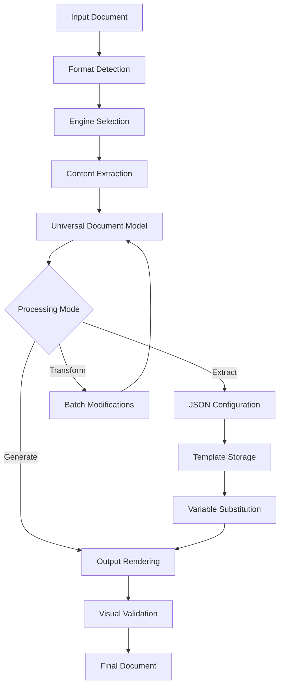

# System Architecture

This document describes the architecture and design of the Multi-Format Document Engine.

## Overview

The Multi-Format Document Engine is designed as a modular, extensible system for processing various document formats (PDF, PSD, etc.) through a unified interface. The architecture emphasizes:

- **Modularity**: Clear separation of concerns with well-defined interfaces
- **Extensibility**: Easy addition of new document formats and processing engines
- **Maintainability**: Clean code structure with comprehensive testing
- **Performance**: Efficient processing of large documents with memory management
- **Security**: Safe handling of potentially untrusted document content

## Core Components

### 1. Universal Document Model (UDM)

The Universal Document Model provides a format-agnostic representation of document content:

```python
from pdfrebuilder.models.universal_idm import UniversalDocument, PageUnit, Layer, TextElement

# All document formats are converted to this unified structure
document = UniversalDocument.from_json(config_data)
```

**Key Features:**

- **Format Independence**: Unified representation for PDF, PSD, and future formats
- **Rich Content Support**: Text, images, vector graphics, and complex shapes
- **Hierarchical Structure**: Layer-based organization with proper z-ordering
- **Metadata Preservation**: Complete document properties and creation information
- **Type Safety**: Comprehensive data validation with Pydantic models

### 2. Engine Abstraction Layer

The engine abstraction allows multiple processing backends with consistent interfaces:

```
src/pdfrebuilder/engine/
├── document_parser.py           # Base parser interface
├── document_renderer.py         # Base renderer interface
├── extract_pdf_content_fitz.py  # PyMuPDF PDF implementation
├── extract_psd_content.py       # PSD processing implementation
├── reportlab_engine.py          # ReportLab PDF renderer
├── pdf_engine_selector.py       # Engine selection and comparison
└── batch_modifier.py            # Document transformation engine
```

### 3. Processing Pipeline

The system follows a flexible multi-stage pipeline:

1. **Format Detection**: Automatic identification of input document format
2. **Engine Selection**: Choose appropriate parser/renderer based on format and requirements
3. **Extraction**: Convert input documents to Universal Document Model
4. **Transformation**: Apply modifications, validations, or enhancements
5. **Validation**: Verify document integrity and font availability
6. **Generation**: Render output in desired format with visual comparison

## Data Flow



### Processing Modes

The system supports multiple processing modes:

- **Extract Mode**: Convert documents to JSON configuration
- **Generate Mode**: Render documents from JSON configuration
- **Full Mode**: Complete extract-transform-generate pipeline with validation
- **Debug Mode**: Generate layer-by-layer visualization for debugging

## Module Structure

### Core Modules

```
src/pdfrebuilder/
├── models/                    # Data models and validation
│   ├── universal_idm.py      # Universal Document Model definitions
│   ├── schema_validator.py   # Document validation logic
│   ├── schema_migration.py   # Version migration support
│   └── psd_effects.py        # PSD-specific effect models
├── engine/                    # Processing engines and interfaces
│   ├── document_parser.py    # Base parser interface
│   ├── document_renderer.py  # Base renderer interface
│   ├── batch_modifier.py     # Document transformation engine
│   ├── pdf_engine_selector.py # Engine selection and comparison
│   └── validation_*.py       # Visual validation components
├── tools/                     # Utility functions and helpers
│   ├── schema_tools.py       # Schema manipulation utilities
│   └── generic.py            # General-purpose utilities
├── font/                      # Font management system
│   ├── font_utils.py         # Core font registration and substitution logic
│   ├── font_validator.py     # Font validation and licensing
│   └── googlefonts.py        # Google Fonts integration
├── cli/                       # Command-line interfaces
│   ├── batch_modifier_cli.py # Batch processing CLI
│   └── reportlab_test_cli.py # Engine testing CLI
```

### Engine Implementations

Each engine implements standardized interfaces for consistent behavior:

```python
from abc import ABC, abstractmethod
from pdfrebuilder.models.universal_idm import UniversalDocument

class DocumentParser(ABC):
    @abstractmethod
    def parse(self, input_path: str, extraction_flags: dict) -> UniversalDocument:
        """Parse document to Universal Document Model"""
        pass

class DocumentRenderer(ABC):
    @abstractmethod
    def render(self, document: dict, output_path: str, original_path: str = None) -> None:
        """Render Universal Document Model to output format"""
        pass
```

### Current Engine Implementations

- **PyMuPDF (Fitz) Engine**: Primary PDF processing engine with comprehensive feature support
- **ReportLab Engine**: Enhanced PDF generation with precise font handling and licensing
- **PSD Engine**: Experimental support for Adobe Photoshop files (in development)

## Extension Points

The architecture supports extension through well-defined interfaces:

### 1. Custom Document Parsers

```python
from pdfrebuilder.engine.document_parser import DocumentParser

class CustomFormatParser(DocumentParser):
    def parse(self, input_path: str, extraction_flags: dict) -> UniversalDocument:
        # Implement custom format parsing logic
        pass

    def supports_format(self, file_path: str) -> bool:
        # Return True if this parser can handle the file
        pass
```

### 2. Custom Renderers

```python
from pdfrebuilder.engine.document_renderer import DocumentRenderer

class CustomRenderer(DocumentRenderer):
    def render(self, document: dict, output_path: str, original_path: str = None) -> None:
        # Implement custom rendering logic
        pass
```

### 3. Transformation Plugins

```python
from pdfrebuilder.engine.batch_modifier import BatchModifier

class CustomTransformation:
    def apply(self, document: UniversalDocument) -> UniversalDocument:
        # Implement custom document transformations
        pass
```

### 4. Validation Extensions

```python
from pdfrebuilder.engine.validation_strategy import ValidationStrategy

class CustomValidator(ValidationStrategy):
    def validate(self, original_path: str, rebuilt_path: str) -> ValidationResult:
        # Implement custom validation logic
        pass
```

## Performance Considerations

### Memory Management

- **Streaming Processing**: Large documents processed in chunks
- **Lazy Loading**: Content loaded only when needed
- **Resource Cleanup**: Automatic cleanup of temporary files and memory
- **Configurable Limits**: Memory and processing time limits

### Optimization Strategies

- **Caching**: Font metrics and image processing results cached
- **Parallel Processing**: Multi-threaded operations for independent tasks
- **Efficient Data Structures**: Optimized data models for common operations
- **Progressive Loading**: UI updates during long-running operations

### Scalability

- **Batch Processing**: Efficient handling of multiple documents
- **Resource Monitoring**: Track memory and CPU usage
- **Configurable Output**: Flexible output directory management
- **Error Recovery**: Graceful handling of processing failures

## Security Model

### Input Validation

- **File Type Validation**: Strict checking of input file formats
- **Content Sanitization**: Removal of potentially malicious content
- **Size Limits**: Configurable limits on file and memory usage
- **Path Validation**: Prevention of directory traversal attacks

### Processing Security

- **Sandboxed Execution**: External tools run in controlled environments
- **Resource Limits**: CPU and memory limits enforced
- **Safe Defaults**: Secure configuration options by default
- **Error Handling**: Secure error messages without information disclosure

### Font Security

- **Font Validation**: Comprehensive validation of font files
- **Licensing Checks**: Verification of font usage rights
- **Safe Font Loading**: Protected font file processing
- **Fallback Mechanisms**: Safe fallback fonts for missing or invalid fonts

## Configuration Management

### Settings Architecture

```python
# Centralized configuration with dynamic resolution
from pdfrebuilder.settings import CONFIG, get_config_value, configure_output_directories

# Flexible output directory management
configure_output_directories(
    base_dir="./custom_output",
    test_dir="./test_results",
    reports_dir="./reports"
)

# Dynamic configuration resolution
image_dir = get_config_value("image_dir")  # Resolves to configured path
```

### Configuration Features

- **Dynamic Path Resolution**: Paths resolved based on current configuration
- **Environment-Specific Settings**: Different settings for development/production
- **Override Support**: Manual overrides via JSON5 configuration files
- **Validation**: Configuration validation with helpful error messages

## Future Architecture

### Planned Enhancements

1. **Plugin System**: Dynamic loading of custom parsers and renderers
2. **REST API**: Web service interface for remote document processing
3. **Distributed Processing**: Support for large-scale batch operations
4. **Real-time Processing**: Streaming document processing capabilities
5. **Advanced Caching**: Intelligent caching of processing results
6. **Monitoring Integration**: Comprehensive logging and metrics collection

### Extensibility Roadmap

- **Format Support**: Additional document formats (DOCX, PPTX, etc.)
- **Cloud Integration**: Support for cloud storage and processing
- **AI Integration**: Machine learning for improved extraction accuracy
- **Collaborative Features**: Multi-user document processing workflows

## Implementation Details

For specific implementation details, see:

- **[API Documentation](api/)**: Complete interface specifications
- **[Engine Documentation](api/engines/)**: Engine-specific implementation details
- **[Model Documentation](api/models/)**: Data structure and validation details
- **[Configuration Reference](reference/configuration.md)**: Complete configuration options
- **[Security Guidelines](SECURITY.md)**: Detailed security considerations
